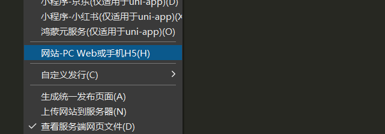
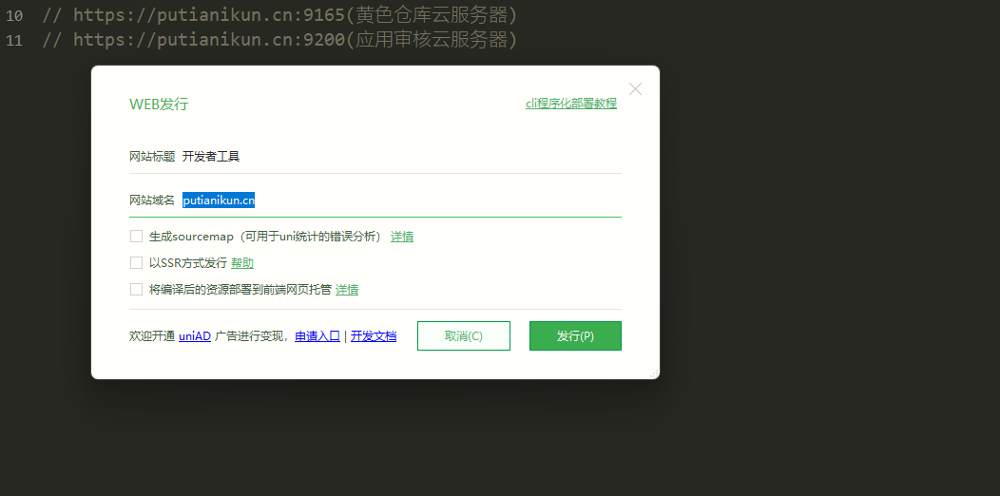
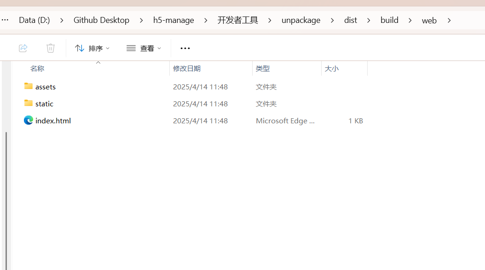
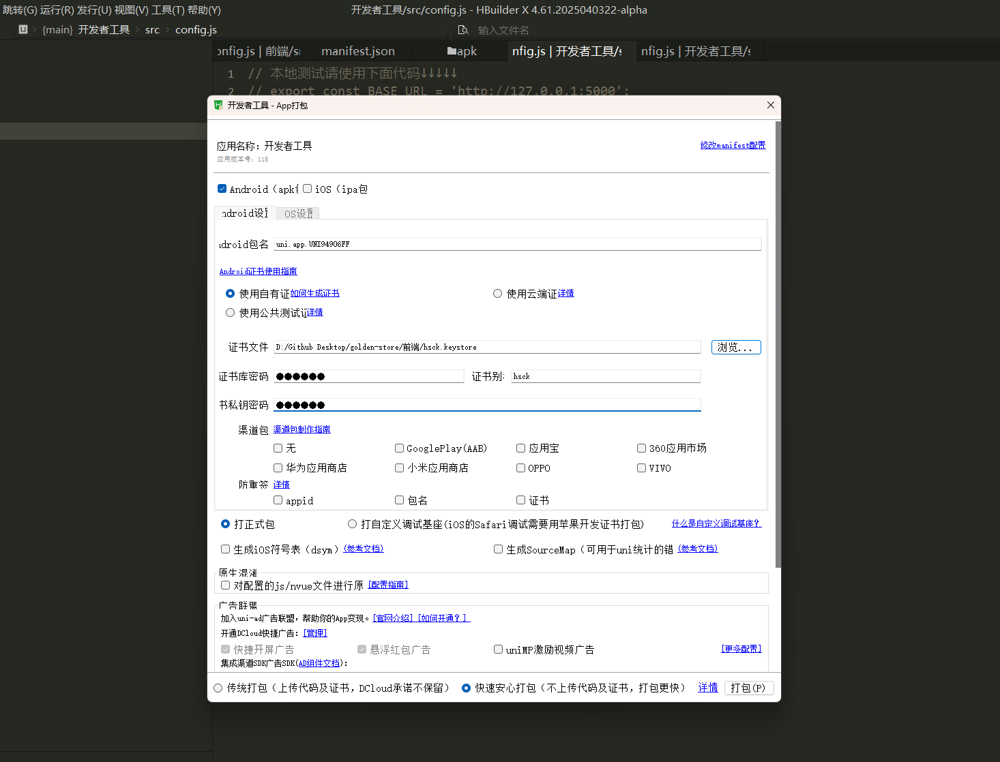

# UniApp 打包操作指南

## 一、H5 打包流程

### 1. 配置服务器地址

1. **进入项目目录**：  
   打开 `src/config` 文件夹。

2. **修改服务器地址**：  
   编辑 `config.js` 文件，将服务器地址配置为实际的 URL 。  
   

3. **配置 WEB 发行**：  
   

### 2. 执行打包操作

1. **完成配置后执行打包命令**：  
   点击确认即可打包，然后看终端输入打包目录

2. **生成核心文件**：  
   打包完成后会生成以下三个核心文件：
   - `index.html`
   - `static/`（静态资源目录）
   - `asserts/`  
     

## 二、APK 打包流程

### 1. 打包 APK

1. **点击发行的 AP 打包**：  
   在打包界面选择 **自有证书**。

2. **配置证书信息**：

   - **Key 文件路径**：`golden-storce/前端/sck.keystore`
   - **证书密码**：`123123`
   - **私钥密码**：`123123`
   - **别名**：`hsck`

3. **点击打包**：  
   完成配置后点击打包按钮，生成 APK 文件。  
   打包完成后会生成一个 APK 文件。  
   

### 2. 修改版本号

如果需要修改版本号，请在前端目录下的 `manifest.json` 文件中进行修改。  
找到对应字段并更新版本号：


### 3.插件市场安装 scss 插件

## 三、导入一个 UI 框架

### 1.插件市场安装 scss 插件

https://ext.dcloud.net.cn/plugin?id=2046

### 2.复制 UI 库到项目

https://ext.dcloud.net.cn/plugin?name=uview-plus

### 3.main.js
以下是在项目中配置 uview-plus 的代码：

```js
// import uviewPlus from '@/uni_modules/uview-plus'
// Vue.use(uviewPlus)
```

请将上述代码添加到你的 Vue 项目中。

### 4.App.vue

将<code>&lt;style&gt;&lt;/style&gt;</code>替换为

&lt;style lang="scss"&gt;
	@import "@/uni_modules/uview-plus/index.scss";
&lt;/style&gt;

### 5.uni.scss

最前面加入
@import '@/uni_modules/uview-plus/theme.scss';

### 6.manifest.json

在“map-weixin”和 "map-toutiao"中加入
"mergeVirtualHostAttributes" : true

### 7.安装依赖库

npm i dayjs
npm i clipboard

### 8. pages.json
在 pages 同级配置 easycom：

在 `pages.json` 中与 pages 同级配置 `easycom`：

```json
{
  "easycom": {
    "autoscan": true,
    "custom": {
      "^u--(.*)": "@/uni_modules/uview-plus/components/u-$1/u-$1.vue",
      "up-(.*)": "@/uni_modules/uview-plus/components/u-$1/u-$1.vue",
      "u-([^-].*)": "@/uni_modules/uview-plus/components/u-$1/u-$1.vue"
    }
  }
}

