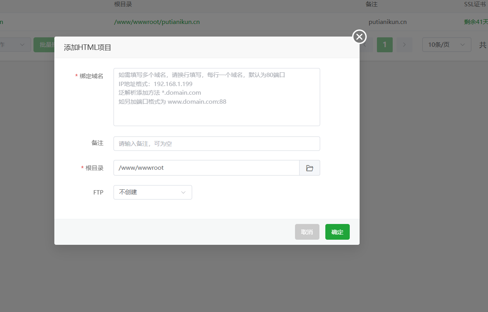
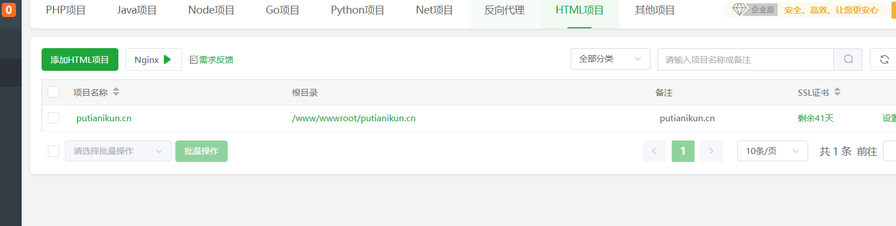
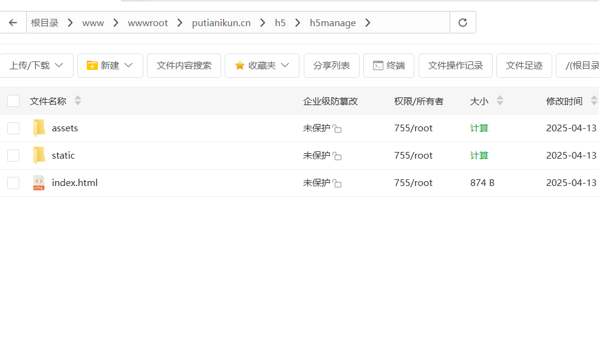

# 宝塔面板网站部署指南（公司项目已经全面采用 Docker）

## 一、网站配置

### 1. 项目入口说明

进入宝塔服务器后，网站页面包含：

- HTML 项目：`putianikun.cn` 主站配置
- Python 项目：后端服务
- 反向代理：用于代理配置
  

---

### 2. Python 项目部署

操作步骤：

1. 点击"Python 项目" -> "添加项目"
2. 配置参数：
   - 项目名称：自定义（示例：hsck_server）
   - Python 版本：按需选择
   - 项目路径：`/www/wwwroot/python_project/`（示例路径）
   - 启动命令：`python main.py`（根据实际启动文件调整）

配置示例：

项目目录结构：

---

### 3. HTML 项目部署

操作步骤：

1. 添加站点时填写服务器 IP 地址
2. 配置 SSL 证书：
   - 选择证书类型
   - 上传证书文件

配置示例：

---

### 4. 反向代理配置

操作步骤：

1. 添加反向代理规则
2. 配置参数：
   - 代理名称：自定义
   - 目标 URL：填写后端服务地址（如：`http://127.0.0.1:5001`）

配置示例：

---

## 二、服务启动方法

### 1. Python 项目

通过 Python 项目管理器检查运行状态：

### 2. HTML 项目

通过 Nginx 服务管理启动：

### 3. 反向代理

配置完成后自动生效，无需单独启动

---

## 三、H5 项目部署

部署方法：

1. 将 uniapp 打包后的 H5 文件
2. 上传至指定目录：`/www/wwwroot/putianikun.cn/h5/h5manage/`
3. 配置对应的站点目录

目录示例：

