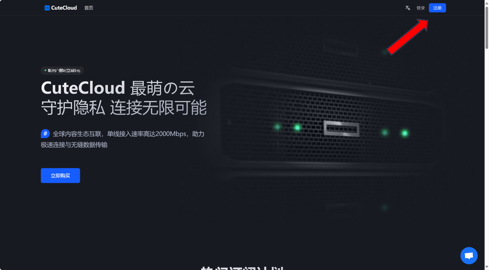
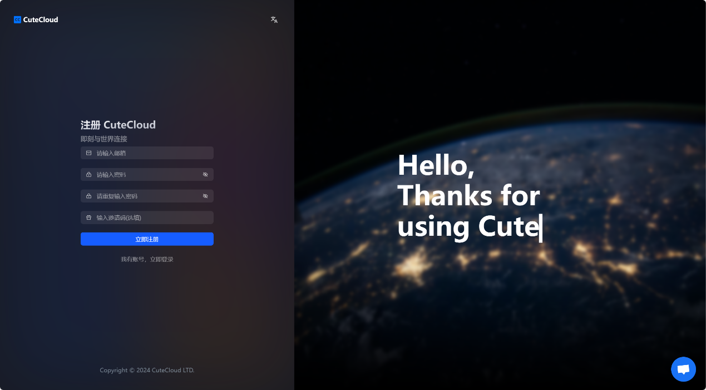
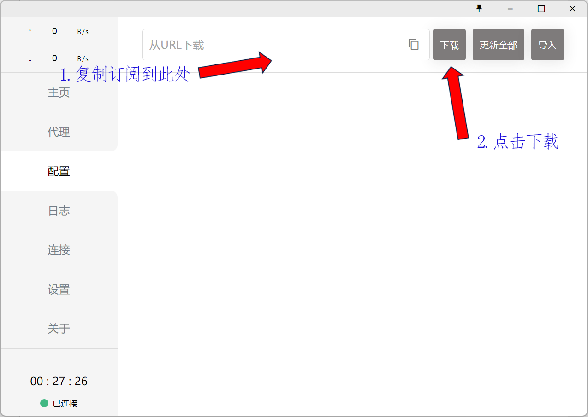

## 访问外网教程

### 第一部分.打开 Vpn 环境

1.如果已经自备 Vpn，则打开 Vpn，直接跳到教程第二部分；

2..如果没有自备 Vpn，点击链接https://ikuuu.one注册或登录账号，

按照首页教程打开 Vpn 环境，

### 第二部分. 打开 CuteCloud

Vpn 环境下打开网址 ure.best，或者点击链接https://ure.best/register?code=hyoLOeHC，注册或登录账号。使用邀请码hyoLOeHC可以获取优惠。

### 第三部分.获取订阅链接

<u>获取订阅链接或者直接用公司提供的。**（价格一样，但含有高级节点）**</u>

### 第四部分.

1.电脑版如图所示，复制订阅到此处，点击下载 ，

<u>（下载成功后，结果如图所示）</u>
点击代理手动选择地区，

选好地区之后，点击主页，打开系统代理即可使用。

2.手机版如图所示。

### 第五部分.

免费 VPN 网址
https://ikuuu.one
