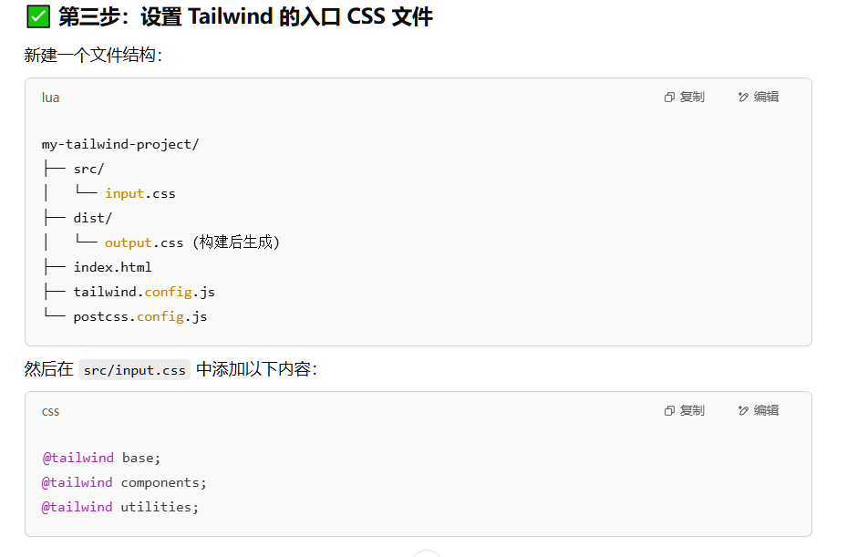

# 使用 Tailwind CSS 3 进行开发

## 进入项目目录

初始化项目：

```bash
npm init -y
```

## 安装 Tailwind CSS 和必要的工具

运行以下命令安装 Tailwind CSS 和相关工具：

```bash
npm install -D tailwindcss@3 postcss autoprefixer
npx tailwindcss init -p
```

## 示例图片




## tailwindcss 官方文档

[tailwindcss 官方文档](https://tailwindcss.com/docs/installation?ref=devdocs)
